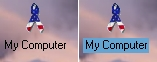



## Transparent Icon Text Background

### Description

This is quite possibly the smallest application you can write in VB that actually serves a purpose. You get 2 for the price of one here in this zip file and both do the same thing only in different ways.

The first program in the module only directory toggles the desktop Icon text Background from it's default color to transparent, and back to normal. I have it in my start up directory so it will run every time windows starts. In my opinion it should be built into windows and this shows how easy it would be.

This will also show you how to create a complete application with only a module (no forms needed). A Little side note is something quite weird I ran into with this: The exact same program written in C++ is actually twice the size in executable file size... hmm...

Let me know what you think.

One other thing is that active desktop has to be turned off. To do this (R)click the desktop choose the web tab and un-check active desktop.
 
### More Info
 

             |
---                |---
**Submitted On**   |2001-09-17 19:17:10
**By**             |[John Flynn](https://github.com/Planet-Source-Code/PSCIndex/blob/master/ByAuthor/john-flynn.md)
**Level**          |Intermediate
**User Rating**    |5.0 (15 globes from 3 users)
**Compatibility**  |VB 6\.0
**Category**       |[Complete Applications](https://github.com/Planet-Source-Code/PSCIndex/blob/master/ByCategory/complete-applications__1-27.md)
**World**          |[Visual Basic](https://github.com/Planet-Source-Code/PSCIndex/blob/master/ByWorld/visual-basic.md)
**Archive File**   |[Transparen265799172001\.zip](https://github.com/Planet-Source-Code/john-flynn-transparent-icon-text-background__1-27321/archive/master.zip)

